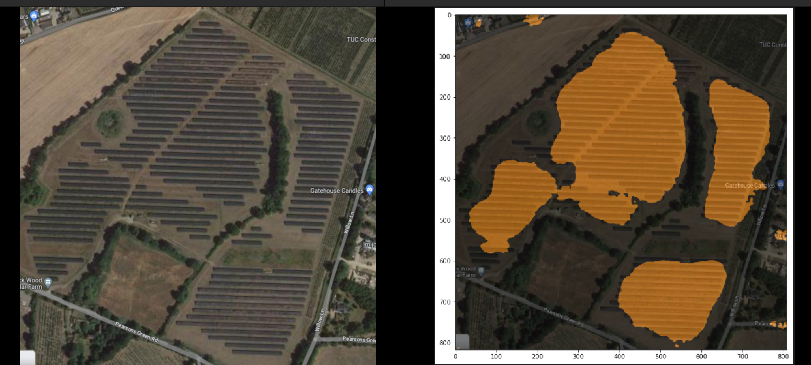

# Contents
1. [Introduction](#introduction)
2. [Downloading the dataset for fine-tuning](#dataset-details)
3. [Fine-tuning the model](#fine-tuning)
4. [Inference](#inference)

# Introduction
* Estimating the total capacity of a solar site from imagery is a common and challenging task.
* The approach taken here is based on semantic segmentation of the site into panels and non-panels to obtain an estimate of total panel surface area.
* Recent advances in transformer-based segmentation models allow us to have few-shot learning capabilities, which is useful for this task due to the scarcity of annotated data. We therefore use a pre-trained SegNet transformer (https://arxiv.org/abs/1511.00561) and fine-tune it on a small dataset of annotated images obtained from a public research initiative.
* Additionally, due to the expensive nature of acquiring satellite imagery, workflows should be able to leverage open datasets such as google maps imagery. Our results show that we can apply few-shot learning to this task and generalize to unseen lower-resolution imagery. 

# Dataset details
- Images for fine-tuning on sites in various environments can be found at https://zenodo.org/record/5171712 
- The following categories of site environments are available:

        - Cropland
        - Grassland
        - Saline/Alkali
        - Shrubwood
        - Water surface
        - Rooftop

* Dataset was produced for public use courtesy of Jiang Hou, Yao Ling, & Liu Yujun. (Multi-resolution dataset for photovoltaic panel segmentation from satellite and aerial imagery 2021)

# Fine-tuning
* In order to run the training procedure:
    1. Download the portion of the dataset you wish to use for fine-tuning and set the location to the environment variable `IMAGE_FOLDER_PATH`
    2. Run `python train.py` to begin training. The model will checkpoints will be saved in the parent directory.

# Inference
* To run inference, run `MODEL_CHKPT=<path to model checkpoint> TEST_IMAGEPATH=<path to test image> python inference.py`
